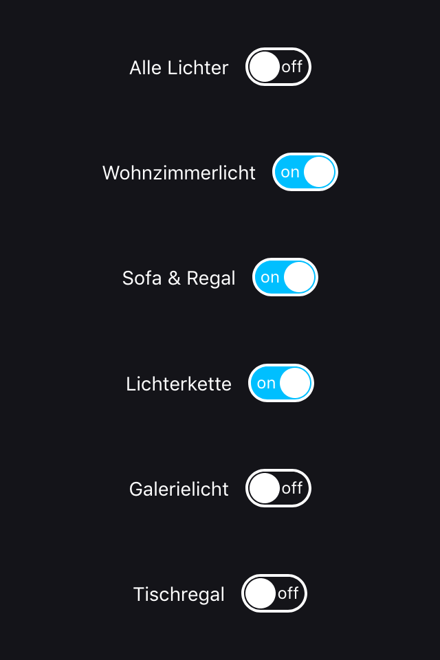
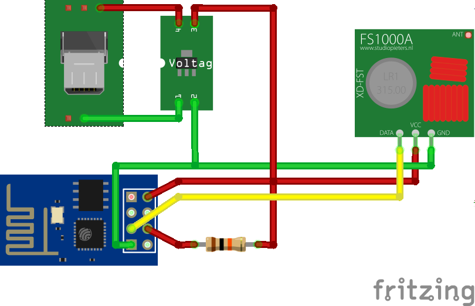

# Connect Alexa to RC Switches

Control RC switches over Amazons Alexa. 

## Features

- Control 433.92MHz RC switches with Alexa via [FauxmoESP](https://bitbucket.org/xoseperez/fauxmoesp)
- Webinterface (add to home screen)
- API: 
    - Switch devices via GET requests
    - Get device state via GET request
- Over the air updates
- Website resources on SPIFFS

## Development

Requires assembled hardware ([see below](#Hardware)) and [PlatformIO](https://platformio.org).

1. Create ``src/secret.h`` from ``src/secrects.template.h``
1. Set SSID and password of your WLAN and over the air hostname
1. Update switch IDs depending on your dip switch settings (see _ReceiveDemo_Simple_ in examples of rc-switch to get them)
1. First deploy only: 
    1. Comment out ``upload_port`` and ``upload_port`` in ``platform.io`` 
    1. Plug device to FTDI adapter
1. Flash device via OTA update/FTDI adapter
1. Upload web resources to SPIFFS

### Dependencies

Required libraries:

- ArduinoOTA
- rc-switch
- ESPAsyncTCP
- FauxmoESP

## Deployment

1. Disable verbose logging: set ``MODE`` to ``MODE_PRODUCTION``
1. Flash device

## Hardware

### Parts

- Amazon Echo Device ([Amazon Affiliate Link](https://amzn.to/2OVAQVB))
- ESP8266 (ESP-01)
- Voltage Regulator (AMS1117)
- USB Micro Plug
- 433.92MHz receiver (FS1000A)
- Wires
- RC Switches ([Amazon Affiliate Link](https://amzn.to/2OSig0y))
- Plastic case
- USB cable (USB A to micro)
- Power supply (1A)

### Wiring

[See Fritzing Sketch](docs/Wiring.fzz).

